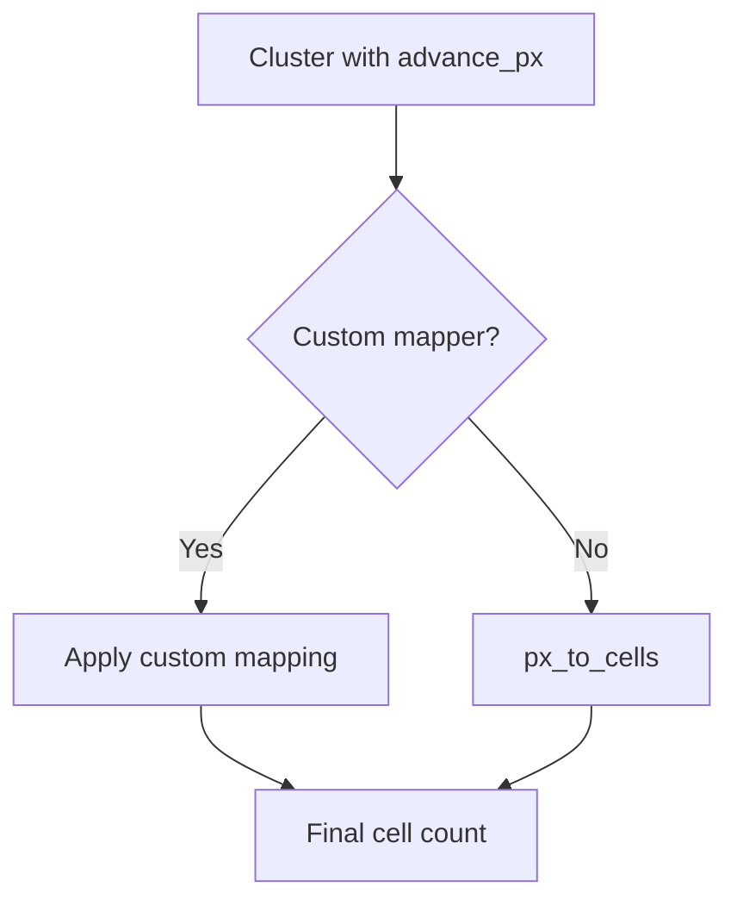

# rich-ctl Technical Documentation

This document provides a comprehensive technical overview of the rich-ctl library, including the underlying architecture, implementation details, and step-by-step processing flow. It serves as a technical reference for both users and developers working with the library.

## Table of Contents

1. [Architecture Overview](#architecture-overview)
2. [Processing Pipeline](#processing-pipeline)
3. [Core Components](#core-components)
   - [Text Shaping](#text-shaping)
   - [Width Measurement](#width-measurement)
   - [Rich/Textual Patching](#richtextual-patching)
   - [Bidirectional Text Support](#bidirectional-text-support)
4. [Technical Implementation Details](#technical-implementation-details)
5. [API Reference](#api-reference)
6. [Performance Considerations](#performance-considerations)
7. [Future Enhancements](#future-enhancements)

## Architecture Overview

rich-ctl implements a modular architecture that integrates HarfBuzz shaping capabilities with Rich/Textual rendering. The library follows a pipeline approach where Unicode text passes through several processing stages before being rendered to the terminal.


The library uses a monkey-patching approach to seamlessly integrate with existing Rich/Textual applications, requiring minimal changes to existing code.

## Processing Pipeline

Here's the step-by-step sequence of how rich-ctl processes text:

1. **Text Input**: The process begins when a string is passed to `console.print()` or similar Rich/Textual methods
2. **Normalization**: The text is normalized to Unicode NFC form
   - Ensures combining marks are properly handled
   - Implemented in `shape_text()` function
3. **Script Analysis**: The script of the text is identified (optional)
   - Currently defaults to "latn" if not specified
   - Future versions will implement automatic script detection
4. **HarfBuzz Shaping**: The text is passed to HarfBuzz for proper shaping
   - Creates a HarfBuzz buffer with appropriate direction/script/language
   - Shapes the text using HarfBuzz's algorithms
   - Maps the shaped glyphs back to original character clusters
5. **Width Calculation**: Each shaped cluster's advance width is converted to terminal cells
   - Pixel-to-cell conversion using the configurable cell width
   - Optional custom width mappers for special handling of specific scripts
6. **Rich Integration**: Rich's text measurement is patched to use cluster-aware calculations
   - Intercepts calls to `Segment.cell_len`
   - Uses shaped cluster width for non-ASCII text
7. **Terminal Rendering**: The properly measured text is rendered to the terminal

## Core Components

### Text Shaping

The text shaping component is responsible for converting Unicode text into properly shaped glyph clusters with accurate metrics.

**Key Files**: `shape.py`

**Primary Classes/Functions**:
- `Cluster` class: Represents a text cluster with its advance width in pixels
- `shape_text()` function: The main shaping function that interacts with HarfBuzz

**Implementation Details**:
1. Text is first normalized to NFC form using `unicodedata.normalize`
2. A HarfBuzz buffer is created with the specified direction, script, and language
3. The text is added to the buffer and shaped using HarfBuzz
4. The shaped glyphs are mapped back to character clusters
5. Each cluster is assigned its appropriate advance width in pixels

**Example**:
```python
clusters = shape_text("తెలుగు", script="telu")
# Returns: [Cluster(text='తె', advance_px=14), Cluster(text='లు', advance_px=12), ...]
```

### Width Measurement

The width measurement component converts pixel advances from HarfBuzz to terminal cell counts.

**Key Files**: `measure.py`

**Primary Classes/Functions**:
- `px_to_cells()` function: Converts pixel advances to terminal cell counts
- `WidthRegistry` class: Registry for custom width mappers

**Implementation Details**:
1. The pixel advance of a cluster is divided by the cell width (default: 8px)
2. The result is ceiling-rounded to ensure enough cells are allocated
3. Custom width mappers can be registered to handle special cases (e.g., East Asian full-width characters)



### Rich/Textual Patching

The patching component integrates rich-ctl with Rich and Textual by monkey-patching their text measurement functions.

**Key Files**: `patch.py`

**Primary Classes/Functions**:
- `patch_segment_measure()`: Patches Rich's `Segment.cell_len` method
- `install_rich_ctl()`: Main entry point for installing patches

**Implementation Details**:
1. The original `Segment.cell_len` method is stored for later use
2. A patched version that uses cluster-aware measurements is installed
3. For ASCII text, the original method is used for performance
4. For non-ASCII text, cluster-aware measurements are used

```python
# Original code in an application
from rich.console import Console
console = Console()
console.print("తెలుగు")  # Renders incorrectly

# Modified code with rich-ctl
from rich_ctl import CTLConsole
console = CTLConsole()
console.print("తెలుగు")  # Renders correctly
```

### Bidirectional Text Support

Bidirectional text support handles right-to-left scripts like Arabic and Hebrew.

**Key Files**: `patch.py` (bidirectional configuration)

**Current Status**: Basic infrastructure is in place but not fully implemented

**Future Implementation**:
1. Integrate with python-bidi for bidirectional reordering
2. Apply reordering before shaping for RTL text
3. Enable configuration via the `bidi=True` parameter on `CTLConsole`

## Technical Implementation Details

### Caching Strategies

rich-ctl employs multiple levels of caching to optimize performance:

1. **Shaping Cache**: The `shape_text()` function is decorated with `@lru_cache` to avoid reshaping the same text multiple times
2. **Cluster Cache**: Shaped clusters are cached in `_cluster_cache` in the patch module
3. **Cell Length Cache**: The patched `_patched_measure_cell` function is also decorated with `@lru_cache`

### Performance Optimizations

Several optimizations are implemented to maintain good performance:

1. **Fast Path for ASCII**: ASCII text bypasses the complex shaping process
2. **Caching**: Multi-level caching reduces repeated operations
3. **Lazy Loading**: Components are only initialized when needed

### HarfBuzz Integration

The library integrates with HarfBuzz via the `uharfbuzz` Python binding:

1. **Buffer Management**: Creates and configures HarfBuzz buffers with appropriate settings
2. **Font Handling**: Currently uses a placeholder font (needs implementation)
3. **Glyph Mapping**: Maps HarfBuzz glyph output back to logical character clusters

## API Reference

### Core Classes

#### `CTLConsole`

Drop-in replacement for Rich's `Console` with CTL support:

```python
CTLConsole(bidi=False, **rich_console_args)
```

- `bidi`: Enable bidirectional text support (default: False)
- `**rich_console_args`: Any arguments accepted by Rich's `Console`

### Core Functions

#### `shape_text`

```python
shape_text(text, direction="ltr", script=None, language="en")
```

- `text`: Unicode text to shape
- `direction`: Text direction ('ltr' or 'rtl')
- `script`: ISO 15924 script tag (e.g., 'arab', 'deva', 'telu')
- `language`: ISO 639 language tag

#### `px_to_cells`

```python
px_to_cells(advance_px, cell_width_px=8)
```

- `advance_px`: Pixel advance from HarfBuzz
- `cell_width_px`: Width of a terminal cell in pixels

#### `install_rich_ctl`

```python
install_rich_ctl(console=None, **options)
```

- `console`: Optional Rich console to patch
- `**options`: Configuration options (e.g., `cell_width_px`, `bidi`)

## Performance Considerations

- **Overhead**: The library adds a small performance overhead for non-ASCII text
- **Caching**: Caching mechanisms minimize repeated calculations
- **ASCII Optimization**: ASCII text bypasses the shaping process

## Future Enhancements

1. **Font Management**: Proper font loading and configuration
2. **Script Detection**: Automatic script detection for mixed-script text
3. **Full Bidi Algorithm**: Complete implementation of the Unicode bidirectional algorithm
4. **Line Breaking**: Ensure line breaks occur only at cluster boundaries
5. **Integration with Textual**: Better support for Textual widgets and layouts
